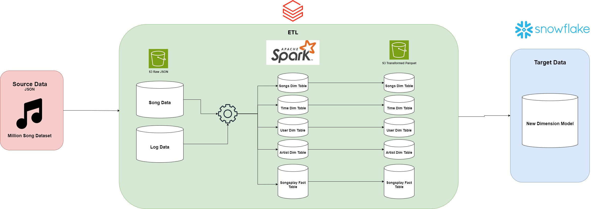

# Mini Music Project ETL
## Table of Contents
1. [Overview](#overview)
2. [DDL scripts](#ddl-scripts-for-snowflake)
3. [Discussion](#Discussion-of-why-datelake-and-datawarehouse)
4. [ETL Pipeline](#ETLPipeline)
5. [Summary](#Summary)

## Overview
**Objective:** The Primary objective of this project is to develop a robust ETL pipeline for Sparkify, A music Streaming startup to facilitate the analysis of user activity and song play data. The project aims to migrate existing data warehouse to a data lake setup, leveraging Snowflake for enhances scalability and performance.

## Data Model of Snowflake Schema


## DDL Scripts For snowflake
```sql
create or replace TRANSIENT TABLE TECHCATALYST_DE.andy.USER_DIM (

    id varchar(16777216),
    firstname varchar (16777216),
    lastname varchar (16777216),
    gender varchar (10),
    level varchar(16777216)
    
);


create or replace TRANSIENT TABLE TECHCATALYST_DE.andy.SONGS_DIM (
    
    song_id varchar(16777216),
    title    varchar(16777216),
    duration float

);


create or replace TRANSIENT TABLE TECHCATALYST_DE.andy.TIME_DIM (

    ts number(38,0),
    datetime timestamp,
    start_time varchar(16777216),
    dayofmonth number(38,0),
    weekofyear number(38,0)
    

);

create  or replace TRANSIENT TABLE TECHCATALYST_DE.andy.ARTIST_DIM (

    artist_id varchar(16777216),
    artist_name varchar (16777216),
    artist_location varchar (16777216),
    artist_latitude float,
    artist_longitude float
);

create or replace TRANSIENT TABLE TECHCATALYST_DE.andy.SONGPLAYS_FACT (

    id varchar(16777216),
    datetime_id varchar(16777216),
    level varchar(16777216),
    song_id varchar(16777216),
    artist_id varchar(16777216),
    sessionId varchar(16777216),
    location varchar(16777216),
    useragent varchar(16777216)

);
```

## Discussion of why datelake and datawarehouse
The purpose of the datalake + datawarehouse is to allow the starts to scale and have flexibility as well as being being able to do their data analytics to find meaningful insights
## ETL Pipeline

The ETL process for Sparkify extracts song data from JSON files in S3 that was taken from the million song dataset, transforms the data by cleaning and normalizing it,  and then reloading it into S3 with structured naming and categorization. Finally, the data is staged and loaded into Snowflake tables for detailed analysis and reporting.
## Summary
Developing a robust ETL pipeline for Sparkify, A music Streaming startup to facilitate the analysis of user activity and song play data. The prupose is to migrate existing data warehouse to a data lake setup, leveraging Snowflake for enhances scalability and performance.